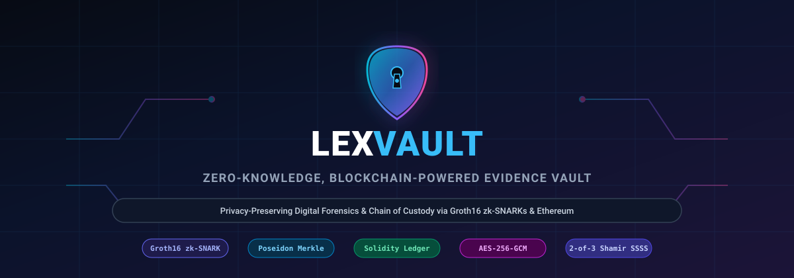
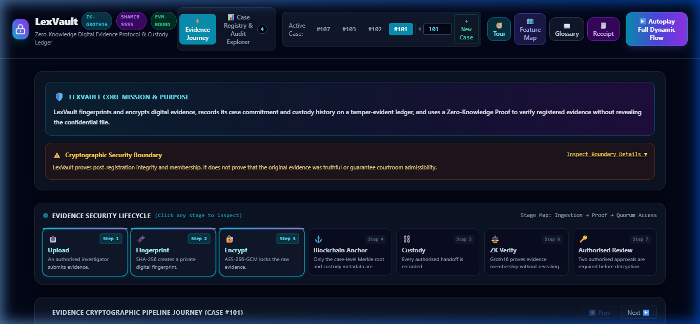
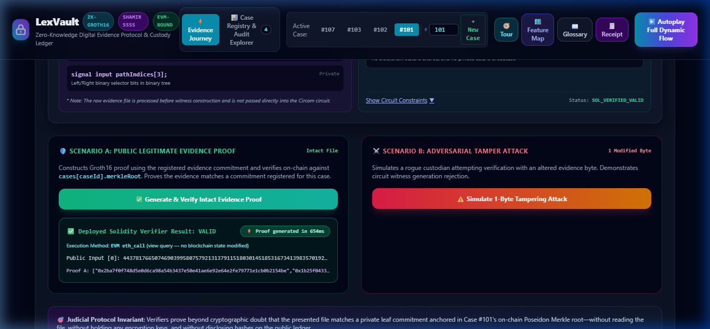
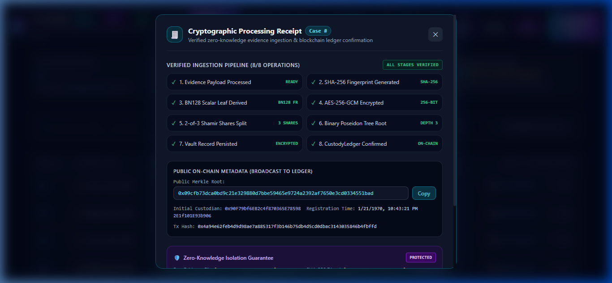
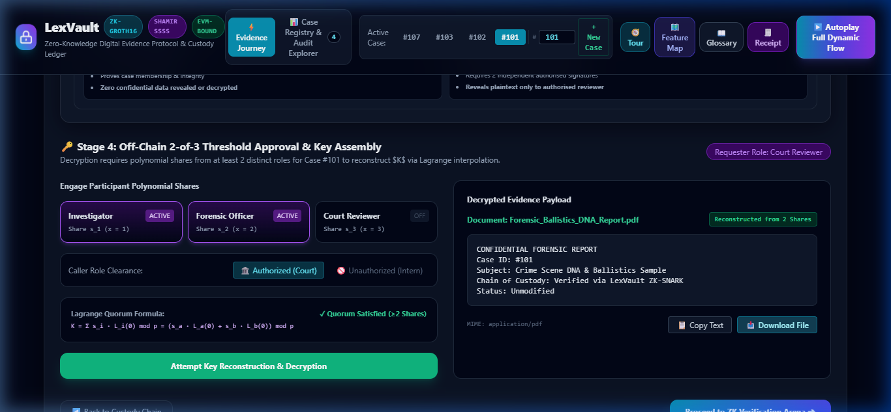
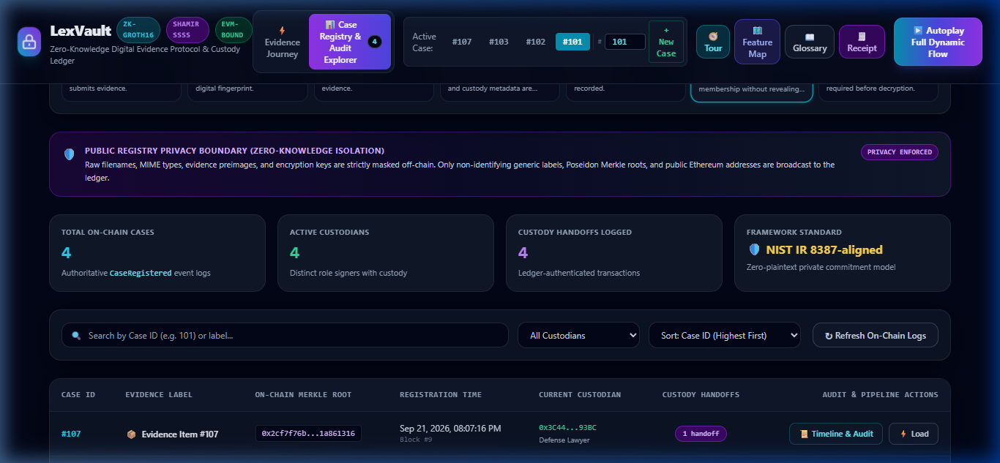
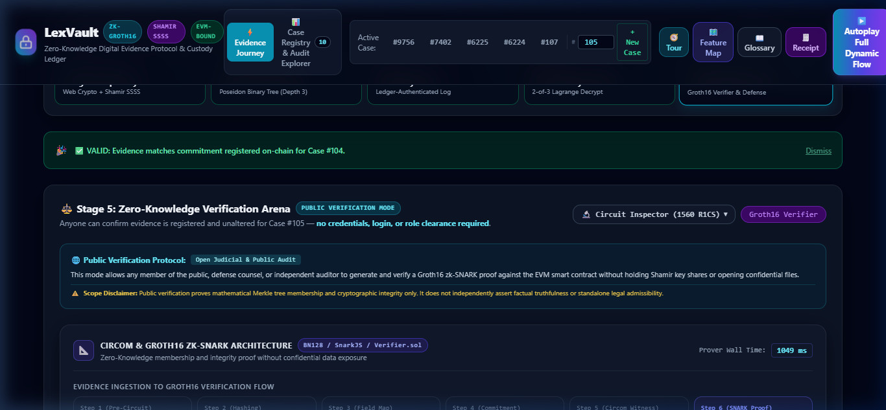
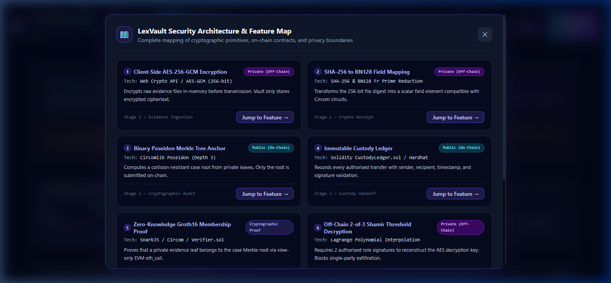
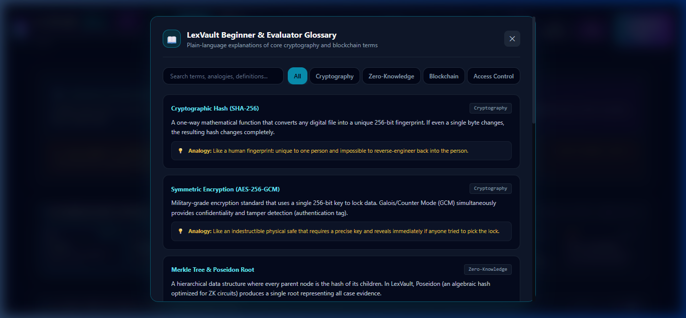

# LexVault

<div align="center">



**Zero-Knowledge, Blockchain-Powered Evidence Vault**

*LexVault helps authorised parties verify that registered digital evidence remains unchanged and audit its custody history without publicly exposing the evidence itself.*

---

[](https://github.com/SAGANA-2006/lexvault/actions/workflows/ci.yml)
[](https://SAGANA-2006.github.io/lexvault/)
[](LICENSE)
[](frontend/)
[](contracts/)
[](circuits/)
[](circuits/)
[](hardhat.config.js)
[](#verified-prototype-results)

<p align="center">
  <a href="https://SAGANA-2006.github.io/lexvault/"><strong>🌐 Launch Public Showcase</strong></a> •
  <a href="#local-setup-and-quickstart"><strong>💻 Local Setup</strong></a> •
  <a href="docs/ARCHITECTURE.md"><strong>📐 Architecture</strong></a> •
  <a href="docs/DEMO_GUIDE.md"><strong>🎯 Demo Walkthrough</strong></a> •
  <a href="docs/SECURITY_BOUNDARIES.md"><strong>🛡️ Security Boundaries</strong></a> •
  <a href="docs/THREAT_MODEL.md"><strong>⚠️ Threat Model</strong></a>
</p>

*Demo Video: `[Coming Soon]` • Pitch Deck: `[Coming Soon]`*

</div>

---

## Table of Contents

- [The Real-World Problem](#the-real-world-problem)
- [LexVault's Solution](#lexvaults-solution)
- [Why LexVault is Different](#why-lexvault-is-different)
- [Don't Take Our Word for It — Falsify It](#dont-take-our-word-for-it--falsify-it)
- [System Architecture](#system-architecture)
- [Evidence Lifecycle](#evidence-lifecycle)
- [Feature Matrix & Implementation Map](#feature-matrix--implementation-map)
- [Verified Prototype Results](#verified-prototype-results)
- [Interface Walkthrough & Screenshots](#interface-walkthrough--screenshots)
- [Security Boundaries & Explicit Disclosures](#security-boundaries--explicit-disclosures)
- [Showcase Mode vs Full Cryptographic Mode](#showcase-mode-vs-full-cryptographic-mode)
- [Project Directory Structure](#project-directory-structure)
- [Local Setup and Quickstart](#local-setup-and-quickstart)
- [Documentation Index](#documentation-index)
- [License & Acknowledgements](#license--acknowledgements)

---

## The Real-World Problem

In criminal, civil, and corporate investigations, digital evidence — such as CCTV surveillance footage, forensic disk dumps, chain-of-custody transfer logs, audit records, and confidential internal reports — must traverse complex multi-agency pipelines involving first responders, forensic examiners, prosecutors, defence counsel, and judicial courts.

This lifecycle exposes three systemic vulnerabilities:

1. **Fragile Centralised Custody Logs**: Custody metadata stored in conventional relational databases or spreadsheets can be modified, backdated, or deleted by privileged administrators without leaving an immutable cryptographic audit trail.
2. **Confidentiality Leaks During Verification**: To prove that an evidence file in hand matches an archived piece of evidence, standard workflows require disclosing the entire raw evidence file to third parties, violating witness privacy, proprietary secrets, or statutory confidentiality protections.
3. **Single-Point Decryption Risk**: Storing master evidence decryption keys in a single vault or with one individual creates a catastrophic single point of failure and exposure to coercion or key theft.

---

## LexVault's Solution

LexVault solves these challenges by uniting zero-knowledge cryptography, client-side encryption, Merkle-tree state accumulation, and smart-contract immutability into an integrated, verifiable pipeline:

- **Client-Side AES-256-GCM Encryption**: Evidence is encrypted in the client browser with an authenticated symmetric cipher before transfer or storage. Decryption requires an authenticated 128-bit tag and 96-bit initialization vector.
- **Deterministic SHA-256 Fingerprinting**: File contents are digested into a 256-bit hash and mapped to an element in the BN128 scalar field for cryptographic compatibility.
- **Poseidon Merkle Tree Commitments**: Evidence commitments are aggregated into a Poseidon hash-based Merkle tree, enabling compact logarithmic inclusion proofs.
- **Ethereum Smart-Contract Custody Ledger**: Case roots, registration timestamps, and immutable transfer events are anchored on-chain in the `CustodyLedger.sol` contract.
- **Groth16 Zero-Knowledge Membership Verification**: Using Circom circuits and Groth16 zk-SNARKs, an investigator mathematically proves an evidence file belongs to a registered case Merkle root without revealing the evidence file, its hash, or witness path.
- **On-Chain EVM Verification via Read-Only `eth_call`**: Proofs are validated against the deployed `Verifier.sol` contract via simulation (`eth_call`), requiring **no transaction submission, zero state mutation, and no gas fees**.
- **2-of-3 Shamir Secret Sharing Quorum Decryption**: Decryption keys are split into three polynomial shares ($t=2, n=3$). Key reconstruction strictly requires two authorized officer approvals.
- **1-Byte Tamper Detection & Audit Explorer**: Provides real-time tamper simulation rejecting altered files, accompanied by an open on-chain audit trail explorer.

---

## Why LexVault is Different

> *"LexVault combines encrypted evidence storage, tamper-evident custody records, storage-bound zero-knowledge membership verification and threshold-controlled evidence access in one demonstrable workflow."*

LexVault does not claim to have invented zero-knowledge proofs, blockchain consensus, Merkle trees, or symmetric encryption. Rather, LexVault synthesizes these foundational cryptographic primitives into a cohesive, developer-verifiable, and court-transparent digital forensics architecture.

---

## Don't Take Our Word for It — Falsify It

LexVault is built for empirical scrutiny. Every security claim can be falsified through reproducible tests in the interface or via the command line:

| Security Claim | What We Claim | How You Can Falsify It in LexVault | Expected System Response |
| :--- | :--- | :--- | :--- |
| **Post-Registration Integrity** | Modifying a single byte of evidence invalidates verification. | Click **"Simulate 1-Byte Tamper"** on Case #101 in the UI, or change 1 character in test evidence. | Groth16 witness generation fails / EVM `verifyProof` returns `false` (`Proof Rejected`). |
| **Case Isolation** | Evidence valid in Case #101 cannot verify against Case #107's root. | Attempt to verify Case #101's witness against Case #107's on-chain root. | Circom constraint violation / Merkle root mismatch rejection. |
| **Zero Knowledge** | Verifier learns nothing about file contents or SHA-256 hash. | Inspect public circuit inputs in the UI or on-chain call payload. | Only `merkleRoot` is public. File contents, `leaf`, and `merklePath` are entirely private. |
| **Gasless Verification** | ZK verification does not spend ETH or write state. | Inspect the RPC call sent during ZK verification. | Verification uses JSON-RPC `eth_call` to `Verifier.sol`. Gas used = 0 Wei, TX count unchanged. |
| **2-of-3 Quorum Access** | 1 key share cannot reconstruct the AES encryption key. | Attempt decryption with Officer 1 only in the Quorum Decryption panel. | Key reconstruction mathematically fails; decryption rejected until 2 distinct shares provided. |
| **Tamper-Evident Custody** | Handoff records cannot be purged or backdated. | Query `CustodyLedger.sol` event logs for Case #101 on the blockchain. | Chronological, indexed on-chain events (`EvidenceRegistered`, `CustodyTransferred`). |

---

## System Architecture

The following diagram illustrates the complete cryptographic and operational dataflow from client upload to on-chain verification:

```mermaid
flowchart TD
    subgraph Client["Client Browser (Investigator / Analyst)"]
        A[Raw Evidence File] -->|SHA-256 Digest| B[Scalar Field Element]
        A -->|AES-256-GCM Encrypt| C[Encrypted Payload + IV + Tag]
        B --> D[Private Leaf Commitment]
    end

    subgraph Backend["Backend & Storage Layer (Off-Chain)"]
        C -->|Secure Storage| E[(Encrypted Vault Storage)]
        D -->|Poseidon Hash Aggregation| F[Poseidon Merkle Tree (Depth 10)]
        F --> G[Public Merkle Root]
    end

    subgraph Blockchain["Ethereum Ledger (Hardhat / EVM)"]
        G -->|Register Case Root| H[CustodyLedger.sol]
        I[Custody Transfer Events] -->|Immutable Audit Log| H
        J[Groth16 Verifier.sol]
    end

    subgraph ZKProof["Zero-Knowledge Verification Pipeline"]
        B -.->|Private Input: leaf| K[Circom Circuit: evidence_membership.circom]
        D -.->|Private Input: originalCommitment| K
        F -.->|Private Input: merklePath & pathIndices| K
        G -->|Public Input: merkleRoot| K
        K -->|snarkjs Groth16 Prover| L[ZK Proof: πA, πB, πC]
        L -->|Read-only eth_call| J
        G -->|Public Root| J
        J -->|Validation Output| M{Verification Result: VALID / REJECTED}
    end

    style A fill:#1e293b,stroke:#3b82f6,stroke-width:2px,color:#fff
    style K fill:#312e81,stroke:#6366f1,stroke-width:2px,color:#fff
    style J fill:#064e3b,stroke:#10b981,stroke-width:2px,color:#fff
    style H fill:#451a03,stroke:#f59e0b,stroke-width:2px,color:#fff
    style M fill:#0f172a,stroke:#38bdf8,stroke-width:2px,color:#fff
```

> **Privacy Guarantee**: Raw evidence files, plaintext fingerprints, encryption keys, and intermediate Merkle witness paths are never published to or stored on the public blockchain.

---

## Evidence Lifecycle

LexVault structures digital evidence management across seven distinct phases:

```
┌─────────────┐     ┌─────────────┐     ┌─────────────┐     ┌─────────────────┐
│  1. UPLOAD  │ ──> │2. FINGERPRT │ ──> │ 3. ENCRYPT  │ ──> │4. ANCHOR ROOT   │
│ Client File │     │ SHA-256 +   │     │ AES-256-GCM │     │ Poseidon Root   │
│ Selection   │     │ Field Mod   │     │ + IV/AuthTag│     │ on Smart Cont.  │
└─────────────┘     └─────────────┘     └─────────────┘     └─────────────────┘
                                                                     │
┌─────────────┐     ┌─────────────┐     ┌─────────────┐             │
│ 7. REVIEW   │ <── │ 6. ZK VERIFY│ <── │ 5. TRANSFER │ <───────────┘
│ 2-of-3 Key  │     │ Groth16 via │     │ Immutable   │
│ Quorum Dec. │     │ EVM eth_call│     │ Custody Log │
└─────────────┘     └─────────────┘     └─────────────┘
```

1. **Upload**: Officer selects an evidence file within the secure browser workspace.
2. **Fingerprint**: The file is hashed with SHA-256 client-side and mapped to the BN128 scalar field.
3. **Encrypt**: Authenticated encryption (AES-256-GCM) secures the binary payload off-chain.
4. **Blockchain Anchor**: The derived Poseidon Merkle root is registered in `CustodyLedger.sol`.
5. **Custody Transfer**: Officers execute and record tamper-evident transfers on-chain.
6. **ZK Verification**: An examiner proves evidence membership via Groth16 without disclosing the file.
7. **Authorised Review**: 2-of-3 threshold approval reconstructs the key for authorized inspection.

---

## Feature Matrix & Implementation Map

| Feature Name | UI Component / Location | Implementation Source File | What It Proves | What It Does NOT Prove |
| :--- | :--- | :--- | :--- | :--- |
| **SHA-256 Fingerprint** | Header / Upload / Crypto Receipt | `backend/src/crypto.ts` | Deterministic file integrity at point of calculation. | Does not prove external truthfulness of evidence prior to hashing. |
| **AES-256-GCM Encryption** | Upload & Storage Panel | `backend/src/crypto.ts` | Confidentiality and ciphertext authenticity off-chain. | Does not protect against malware executing on the client device. |
| **Poseidon Merkle Root** | Case Selector & Ledger View | `backend/src/tree.ts` | Cryptographic accumulation of evidence leaves into one root. | Does not reveal the number or identities of other case files. |
| **Smart-Contract Ledger** | Custody Timeline / Audit Explorer | `contracts/CustodyLedger.sol` | Immutable chronological record of transfers and case roots. | Does not ensure legal admissibility in any specific courtroom. |
| **Groth16 ZK Verification** | ZK Verification Panel | `circuits/evidence_membership.circom` | Mathematical membership of an evidence commitment in a root. | Does not disclose file content, hash, or witness siblings. |
| **1-Byte Tamper Test** | Guided Demo / Verification Action | `frontend/src/App.tsx` | Verifies immediate rejection when payload bytes change. | Does not repair corrupted or maliciously modified files. |
| **2-of-3 Quorum Decryption** | Quorum Decryption Panel | `backend/src/shamir.ts` | Threshold authorization requirement (strictly $\ge 2$ shares). | Does not eliminate risk if single backend holds all 3 shares. |
| **Audit Explorer** | Audit Explorer Tab | `frontend/src/App.tsx` | Transparent read-only view of on-chain state and events. | Does not alter, purge, or override past blockchain transactions. |
| **Cryptographic Receipt** | Live Processing Receipt Panel | `frontend/src/components/CryptoReceiptModal.tsx` | Real-time breakdown of intermediate cryptographic hashes. | Does not replace formal chain-of-custody documentation. |
| **Beginner Glossary** | Header Help / Glossary Modal | `frontend/src/components/GlossaryModal.tsx` | Plain-language definitions of ZK, EVM, and cryptographic terms. | Does not constitute legal advice or formal technical training. |
| **Security Boundaries Panel** | Footer / Verification Notice | `frontend/src/components/SecurityBoundariesModal.tsx` | Clear disclosure of mathematical proofs vs non-goals. | Does not substitute for independent professional security audits. |

---

## Verified Prototype Results

The LexVault prototype has been subjected to rigorous automated verification across all layers:

| Test Suite / Layer | Scope | Checks Passed | Status |
| :--- | :--- | :---: | :---: |
| **Frontend Production Build** | TypeScript Compilation & Vite Bundle | `Passed` | :white_check_mark: Clean build |
| **Smart Contract Test Suite** | Registration, transfers, and verifier integration | `4 / 4` | :white_check_mark: Passed |
| **Circom Circuit Test Suite** | Valid witness, fake leaf, invalid root, path constraints | `4 / 4` | :white_check_mark: Passed |
| **End-to-End Lifecycle Tests** | Full upload $\to$ ZK proof $\to$ EVM verification | `5 / 5` | :white_check_mark: Passed |
| **Case Isolation Regressions** | Cross-case proof rejection & isolation (#101 vs #107) | `12 / 12` | :white_check_mark: Passed |
| **Security Policy Verification** | Quorum thresholds, tamper rejection, secret hygiene | `16 / 16` | :white_check_mark: Passed |
| **Presentation Preflight Suite** | RPC health, contract state, seeded demo cases | `9 / 9` | :white_check_mark: Passed |

> [!IMPORTANT]
> **Prototype Verification Qualification**
> *These checks validate the implemented hackathon prototype behaviour. They do not constitute a professional security audit or guarantee production readiness.*

---

## Interface Walkthrough & Screenshots

### 1. Main Dashboard & Case Overview
The main interface displays active forensic cases, registered on-chain Merkle roots, and live case integrity status.



---

### 2. Zero-Knowledge Proof Verification & EVM Call
Examiners verify evidence membership using Groth16 zk-SNARKs. The circuit validates the Merkle path off-chain, then queries `Verifier.sol` via a read-only EVM `eth_call`.



---

### 3. Real-Time Cryptographic Processing Receipt
Inspect exact cryptographic parameters: SHA-256 digest, scalar reduction, Poseidon leaf, Merkle path index, and proving timestamp.



---

### 4. 2-of-3 Shamir Threshold Quorum Decryption
Demonstrates threshold access control: entering any 2 of 3 valid officer shares reconstructs the AES key; single shares are mathematically rejected.



---

### 5. On-Chain Custody Audit Explorer
Inspect immutable blockchain custody transfer records, officer wallet addresses, timestamps, and transfer notes.



---

### 6. Interactive 8-Step Guided Demo
Step-by-step guided tour walking evaluators through the entire evidence lifecycle from registration to ZK verification and quorum decryption.



---

### 7. Security Architecture & Feature Map
Transparent overview detailing where every cryptographic operation executes and which layer enforces each guarantee.



---

### 8. Forensic Cryptography Glossary
Plain-language reference explaining Groth16, Poseidon hashing, Shamir secret sharing, and EVM simulation for non-technical stakeholders.



---

## Security Boundaries & Explicit Disclosures

### What LexVault Proves
1. **Mathematical Membership**: Proves that a specific evidence commitment exists within a registered on-chain Poseidon Merkle tree root.
2. **Post-Registration Immutability**: Proves the examined evidence file matches the exact byte sequence registered at the recorded timestamp.
3. **Groth16 Zero-Knowledge Correctness**: Proves the validity of the SNARK proof ($\pi_A, \pi_B, \pi_C$) under the BN128 elliptic curve pairing.
4. **Tamper-Evident Custody Chain**: Proves the sequence and metadata of custody handoffs recorded on the Ethereum blockchain.

### What LexVault Does NOT Prove
1. **Pre-Registration Authenticity**: Does not prove evidence was untampered or authentic prior to registration.
2. **Deepfake / AI Detection**: Does not detect AI-generated imagery, voice synthesis, or falsified CCTV content.
3. **Registrar Integrity**: Does not prevent a dishonest officer from uploading falsified evidence as a valid case.
4. **Automatic Legal Admissibility**: Does not guarantee admissibility under jurisdictional rules of evidence (e.g., Federal Rules of Evidence Rule 901/902).
5. **Compromised Endpoint Security**: Does not protect against malware, keyloggers, or memory scrapers on the analyst's machine.
6. **Production Readiness**: This codebase is a hackathon research prototype and has not undergone formal third-party audits.

### Protocol Disclosures
- **Read-Only Verification**: Proof verification is executed via JSON-RPC `eth_call`. It is a read-only EVM state simulation: **no transaction is broadcast, no blockchain state is altered, and zero gas fee is incurred**.
- **Public vs Private Inputs**: The case Merkle root is public. Raw evidence files, hashes, and private witness paths remain strictly private.
- **Shamir Key Distribution in Prototype**: In this prototype, Shamir shares are simulated via a unified backend API for demonstration convenience. In a production multi-tenant deployment, shares **must** be held by physically independent custodians or hardware security modules (HSMs).

---

## Showcase Mode vs Full Cryptographic Mode

LexVault provides two distinct execution environments:

| Feature / Dimension | Public Showcase Mode (Static) | Full Local Cryptographic Mode |
| :--- | :--- | :--- |
| **Hosting Environment** | GitHub Pages (Static Web App) | Local Machine (Node.js + Hardhat) |
| **Backend Requirement** | None (Fully self-contained) | Express API server (`localhost:3001`) |
| **Blockchain Network** | Mocked state with preloaded demo cases | Local Hardhat EVM Node (`localhost:8545`) |
| **ZK Proving Engine** | Simulated Groth16 outputs (`[Demonstration output]`) | Real `snarkjs` Groth16 witness & proof generation |
| **EVM Verifier Execution** | Pre-computed verification assertions | Live `eth_call` to compiled `Verifier.sol` |
| **Client-Side Encryption** | Simulated / client-memory encryption | Full AES-256-GCM + Shamir share generation |
| **Purpose** | Immediate evaluation, UI review, pitch demo | Reproducible cryptographic falsification & auditing |

---

## Project Directory Structure

```
lexvault/
├── .github/
│   └── workflows/
│       ├── ci.yml                 # CI: build, contract tests, circuit tests, secret check
│       └── pages.yml              # Automated GitHub Pages static showcase deployment
├── backend/
│   └── src/
│       ├── crypto.ts              # SHA-256, AES-256-GCM, scalar field mapping
│       ├── shamir.ts              # 2-of-3 Shamir Secret Sharing implementation
│       ├── tree.ts                # Poseidon Merkle Tree (Depth 10) constructor
│       ├── zkp.ts                 # snarkjs Groth16 witness & proof generator
│       └── server.ts              # Express REST API endpoints
├── circuits/
│   ├── evidence_membership.circom # Circom 2.1 zero-knowledge membership circuit
│   ├── scripts/                   # Circuit compilation and trusted setup scripts
│   └── tests/                     # Circuit unit tests (valid/fake leaves, roots)
├── contracts/
│   ├── CustodyLedger.sol          # On-chain case roots and custody transfer events
│   └── Verifier.sol               # SnarkJS auto-generated Groth16 Solidity verifier
├── docs/
│   ├── ARCHITECTURE.md            # Detailed technical architecture specification
│   ├── DEMO_GUIDE.md              # 60-second evaluator falsification walkthrough
│   ├── RESEARCH_AND_REFERENCES.md # Academic papers, standards, and citations
│   ├── SECURITY_BOUNDARIES.md     # Comprehensive security boundaries & claims
│   ├── THREAT_MODEL.md            # Threat model, attack vectors, mitigations
│   └── screenshots/               # Interface walkthrough screenshots & hero banner
├── frontend/
│   ├── src/                       # React 18 + TypeScript + Tailwind UI application
│   │   ├── components/            # Modals (Crypto Receipt, Glossary, Security Boundaries)
│   │   └── App.tsx                # Main forensic dashboard and interactive panels
│   ├── package.json               # Frontend dependencies (React, Vite, Lucide, Tailwind)
│   └── vite.config.ts             # Vite configuration with relative base and proxy
├── scripts/
│   ├── deploy.js                  # Hardhat deployment script for contracts
│   ├── seed_demo.js               # Seeds demo cases (#101, #102, #103, #107)
│   └── test_security_events_and_policy.js # Automated regression suite
├── hardhat.config.js              # Hardhat configuration (Solidity 0.8.20)
├── package.json                   # Root workspace scripts and dependencies
└── LICENSE                        # MIT License
```

---

## Local Setup and Quickstart

Follow these steps to run the complete cryptographic prototype with live EVM verification:

### Prerequisites

- **Node.js**: Version 18.x or 20.x (`node -v`)
- **npm**: Version 9.x or 10.x (`npm -v`)
- **Git**: For repository cloning

### 1. Clone Repository & Install Dependencies

```bash
git clone https://github.com/SAGANA-2006/lexvault.git
cd lexvault

# Install root dependencies
npm install

# Install frontend dependencies
cd frontend && npm install && cd ..
```

### 2. Compile Smart Contracts & Circom Circuits

```bash
# Compile Solidity contracts
npm run compile:contracts

# (Optional) Recompile Circom ZK circuit (pre-compiled artifacts included)
npm run compile:circuit
```

### 3. Run Test Suites

```bash
# Run Smart Contract unit tests (4/4)
npm run test:contracts

# Run Circom ZK Circuit tests (4/4)
npm run test:circuit
```

### 4. Start Full Local Cryptographic System

In separate terminal windows:

```bash
# Terminal 1: Start local Hardhat EVM node
npm run start:node

# Terminal 2: Deploy contracts and seed demo cases
npm run deploy
npm run seed

# Terminal 3: Start backend Express API server
npm run start:backend

# Terminal 4: Start frontend development server
npm run dev:frontend
```

Open your browser at `http://localhost:3000` to interact with the live local prototype.

---

## Documentation Index

- [Technical Architecture Specification](docs/ARCHITECTURE.md) — Mathematical formulations, circuit constraints, and data flows.
- [Threat Model & Attack Vector Analysis](docs/THREAT_MODEL.md) — Detailed STRIDE threat modeling and adversary boundaries.
- [Evaluator Demo Walkthrough](docs/DEMO_GUIDE.md) — 60-second step-by-step falsification track.
- [Security Boundaries & Claims](docs/SECURITY_BOUNDARIES.md) — Precise enumeration of what LexVault does and does not prove.
- [Academic Research & References](docs/RESEARCH_AND_REFERENCES.md) — Citations for Groth16, Poseidon, Shamir SSSS, and NIST standards.
- [Changelog](CHANGELOG.md) — Version history and release notes.
- [Contributing Guidelines](CONTRIBUTING.md) — Code contribution, PR workflow, and standards.
- [Code of Conduct](CODE_OF_CONDUCT.md) — Community standards.
- [Security Policy](SECURITY.md) — Vulnerability disclosure process.

---

## License & Acknowledgements

This project is licensed under the **MIT License** — see the [LICENSE](LICENSE) file for details.

### Cryptographic Libraries & Standards
- [Circom 2.1 & SnarkJS](https://github.com/iden3/snarkjs) — iden3 zero-knowledge proving stack.
- [Poseidon Hash](https://www.poseidon-hash.info/) — Grassi et al., zero-knowledge-friendly algebraic hashing.
- [Hardhat](https://hardhat.org/) — Ethereum development environment.
- [Ethers.js](https://docs.ethers.org/v6/) — EVM interaction library.
