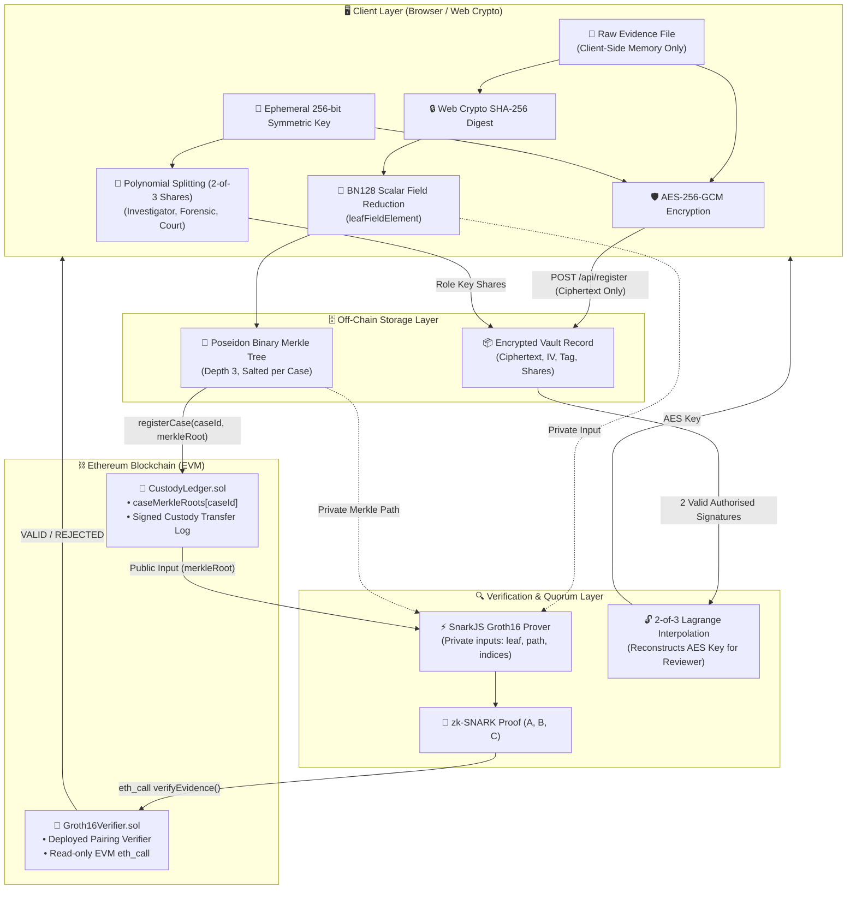

# LexVault — System Architecture & Technical Specification

LexVault is a zero-knowledge, privacy-preserving digital evidence custody and verification protocol. This document outlines the component architecture, dataflows, cryptographic invariants, and smart contract bindings.

---

## 1. High-Level Architecture Diagram

---

## 2. Cryptographic Dataflow Stages

### Stage 1: Client-Side Fingerprinting & AES-256-GCM Encryption
1. **Hashing:** Raw evidence bytes $E$ are processed via `window.crypto.subtle.digest("SHA-256", E)` producing 256-bit digest $H(E)$.
2. **Scalar Field Mapping:** The digest is reduced into the BN128 scalar field:
   $$\text{leaf} = H(E) \pmod{r}$$
   where $r = 21888242871839275222246405745257275088548364400416034343698204186575808495617$.
3. **Key Generation & Shamir Splitting:** A random 256-bit symmetric key $K \in \mathbb{F}_r$ and polynomial $f(x) = K + a_1 x \pmod r$ are generated. Three points are computed:
   - Investigator ($x=1$): $s_1 = f(1)$
   - Forensic Officer ($x=2$): $s_2 = f(2)$
   - Court Reviewer ($x=3$): $s_3 = f(3)$
4. **AES-GCM Encryption:** Evidence is encrypted into ciphertext $C$, 96-bit initialization vector $IV$, and 128-bit authentication tag $Tag$.
5. **Zero-Plaintext Submission:** The client uploads $\{C, IV, Tag, \text{leaf}, \{s_1, s_2, s_3\}\}$ to `/api/register`. Raw evidence bytes are **never transmitted**.

### Stage 2: Poseidon Merkle Tree Commitment
1. Internal tree hashing is computed using the **Poseidon Hash function**, an algebraic SNARK-friendly primitive over BN128.
2. The tree of depth 3 computes the root $R = \text{PoseidonTree}(\text{leaf}, \text{siblings})$.
3. The Merkle root $R$ is anchored on-chain via `CustodyLedger.registerCase(caseId, rootHex)`.

### Stage 3: On-Chain Signed Custody Ledger
1. Custody transfers are recorded on `CustodyLedger.sol` by the current custodian calling `transferCustody(caseId, newCustodian)`.
2. Emits `CustodyTransferred(caseId, from, to, block.timestamp)`.

### Stage 4: Off-Chain 2-of-3 Shamir Threshold Key Reconstruction
1. Decryption requires approval from any 2 distinct authorized roles (e.g. Investigator $x_1$ and Court Reviewer $x_2$).
2. Key reconstruction uses Lagrange interpolation at $x=0$:
   $$K = s_1 \frac{0 - x_2}{x_1 - x_2} + s_2 \frac{0 - x_1}{x_2 - x_1} \pmod r$$
3. Unauthorized roles (e.g. Intern clearance) are rejected by deterministic policy gates before key reconstruction is attempted.

### Stage 5: Zero-Knowledge Groth16 Verification
1. Prover inputs:
   - **Private inputs:** `leaf`, `originalCommitment`, `merklePath[3]`, `pathIndices[3]`.
   - **Public input:** `merkleRoot`.
2. The Circom circuit `EvidenceVaultVerifier` asserts:
   - $\text{leaf} == \text{originalCommitment}$
   - $\text{ComputedRoot}(\text{leaf}, \text{merklePath}, \text{pathIndices}) == \text{merkleRoot}$.
3. Proof verification invokes `Groth16Verifier.verifyEvidence(caseId, a, b, c)` via **read-only EVM `eth_call`**.
4. **Execution Method:** No transaction is submitted, no blockchain state is changed, and no gas fee is paid.

---

## 3. Smart Contract Specifications

### `CustodyLedger.sol`
- `registerCase(uint256 caseId, bytes32 merkleRoot)`: Binds a case ID to its Poseidon Merkle root. Emits `CaseRegistered`.
- `transferCustody(uint256 caseId, address newCustodian)`: Updates custodian if caller is current custodian. Emits `CustodyTransferred`.
- `verifyEvidence(uint256 caseId, uint[2] a, uint[2][2] b, uint[2] c)`: Queries deployed `Groth16Verifier` with the stored `caseMerkleRoots[caseId]`.

### `Groth16Verifier.sol`
- Deployed pairing check contract generated by SnarkJS for BN128 curve.
- Validates the Groth16 relation:
  $$e(A, B) = e(\alpha, \beta) \cdot e(x \cdot \gamma, \delta) \cdot e(C, \delta)$$
